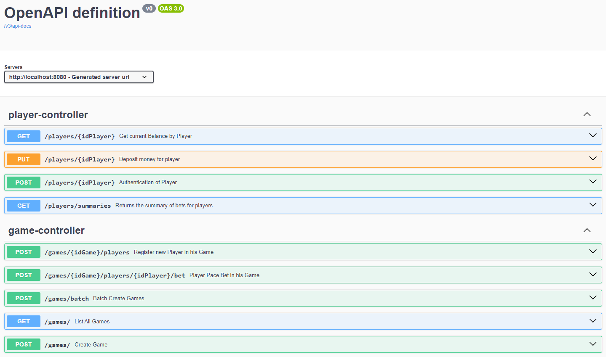

# Coin Toss Game, powered by Spring Boot

## Introduction
This project is a simple REST application for serving a casino. It uses Spring Boot, Spring Data JPA and some other helperService libraries.

# How to run it
I'm using openjdk version "20.0.2" and maven 3 with IntelliJ IDEA 2023.3 (Community Edition)
Or your can use the commands line

## Quick Steps
You can quickly use the below commands to run a spring boot application from a command line.

1. Run the Spring boot application with the java -jar command:
   $ java -jar target/omegasys-0.0.1-SNAPSHOT.jar

2. Run the Spring boot application using Maven:
   $ mvn spring-boot:run

NOTE : Attached the delivery jar file and Source code.

## Documentation 
You can access to OpenAPI definition, available [here](http://localhost:8080/swagger-ui/index.html) and use the swagger-ui,
Or you can import my postman script [here](OmegaSysAPI.postman_collection.json) (file name : OmegaSysAPI.postman_collection.json)

## In addition !
### Example :
Coin Toss Bet:

Prediction: The user predicts that the coin will land on heads.
Assigned Probability: The user assigns a probability to their prediction based on their confidence. Let's say they believe there's a 0.60 (or 60%) chance that the coin will land on heads.

Expressed Probability:
The statement about the probability of winning the coin toss bet could be:
"The probability a user has of winning the coin toss bet is 0.60 (from 0 to 1, 2 decimals)."

Outcome: The coin is tossed, and it lands on heads.
Result: Since the user predicted heads and the coin landed on heads, they win the bet.

This example illustrates how participants in a coin toss bet might assess and express their probability of success based on their prediction of the coin's outcome.

### Assumption 1 : Choosing the Right Approach for concurrent updates
My solution is with AtomicInteger for Code Simplicity ... and conflict resolution is less critical ... yes AtomicInteger might be a more straightforward choice.
Otherwise, Optimistic Locking could be a valid approaches more suitable but with handling conflicts on catch OptimisticLockException and implement custom logic to resolve conflicts or inform the user.

### Assumption 2 :
In the currant schema 

The Player entity has a many-to-one relationship with the Game entity, using the currentGame attribute to represent the game for which the player currently has an active bet.
The Game entity has a one-to-many relationship with the Player entity, using the players attribute to represent the list of players associated with the game.

**This schema allows each Game to have multiple players, but each Player can only be associated with one game at a time. If a player wants to place a new bet or switch to another game, the currentGame attribute in the Player entity would need to be updated accordingly.

### O_o
